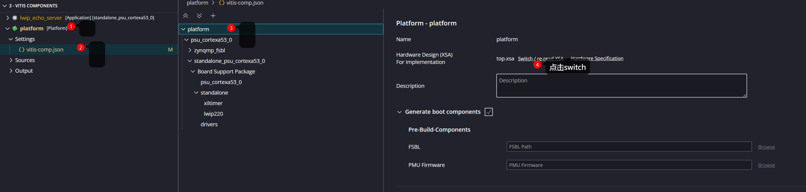
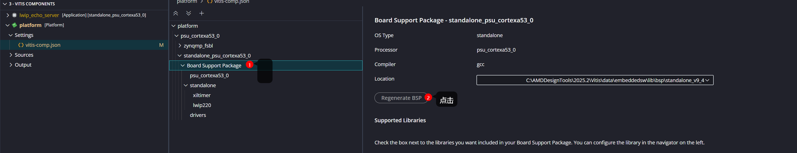

# Hands-On Version Control in Vitis Unified IDE Embedded Design

> !! Vitis Unified IDE 2025.2 版本已测试
>
> 参考文档：https://docs.amd.com/r/en-US/ug1400-vitis-embedded/Source-Control

## 首次提交

1. 确认原 Vitis Unified IDE 2025.2 工程可以正常编译。
2. 将以下文件放到 Vitis workspace 根目录：
   - `.gitignore`
3. 创建第一次git commit

## 更换路径后重建

1. 将仓库 clone 或复制到新路径。

2. 重新platform --> setting --> switch XSA   ，产生 \platform\hw\sdt 文件

   

3. after generate sdt, regenerate bsp in Domain - standalone_psu_cortexa53_0
